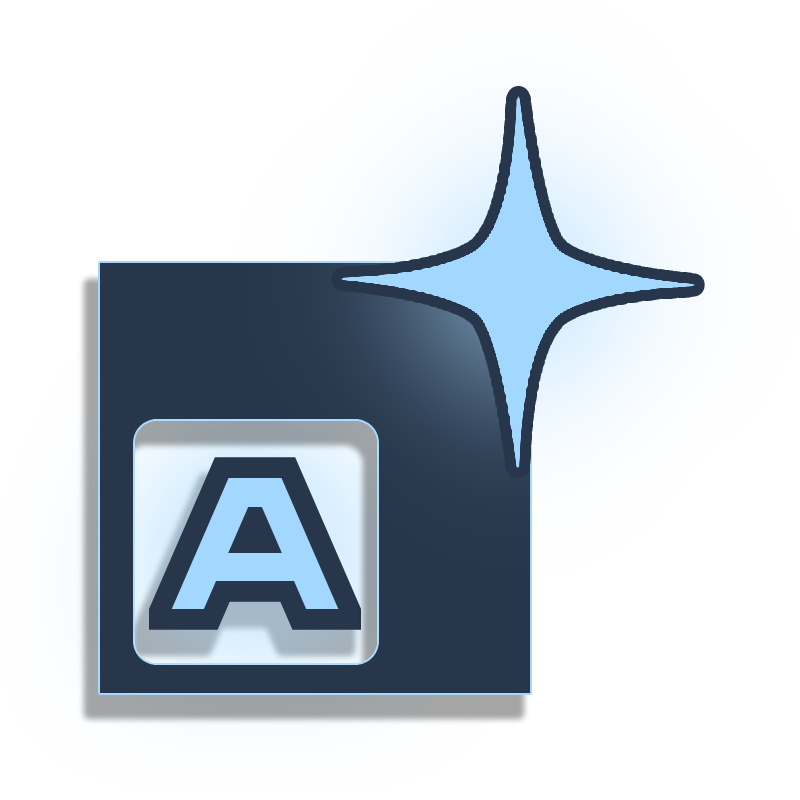

<div align="center">
  
  
  <h1>ArtFramework</h1>
  <p><em>A uniform, modular 2D game framework built on C# and FNA.</em></p>
</div>

---

## 📖 About the Engine

**ArtFramework** is a code-first, open-source 2D game framework designed to provide a highly structured and modular environment for C# game development. Built as an abstraction layer over an FNA backend (utilizing `FNA3D`, `FAudio`, and `SDL3`), the engine emphasizes performance, cross-platform stability, and consistent development logic. 

Inspired by the "all drawables" design philosophy of the osu!framework, ArtFramework focuses on a robust UI and component system. It features built-in modular components, hierarchical scene management, and dynamic texture-handling systems. The framework is specifically tailored for developers who prefer a strictly code-driven approach over large, heavy GUI-based game engines, providing a predictable and highly performant foundation for creating 2D applications and games.

## ⚙️ Setup and Installation

ArtFramework is built using modern C# and standard `.NET` tooling. The repository already includes the necessary native libraries (`FNA3D`, `FAudio`, `SDL3`, `bass`, `libtheorafile`) required for audio, video, and graphics processing.

To get the framework up and running in your local environment, follow these steps:

### Prerequisites
* [.NET SDK](https://dotnet.microsoft.com/download)
* An IDE of your choice (Visual Studio, JetBrains Rider, or VS Code)
* Git

### Installation Steps

1. **Clone the Repository**
   Clone the project to your local machine using Git:
   ```bash
   git clone https://github.com/Aethertenshi/ArtFramework.git
   ```

2. **Navigate to the Directory**
   ```bash
   cd ArtFramework
   ```

3. **Restore Dependencies**
   Restore the necessary .NET packages and dependencies by running:
   ```bash
   dotnet restore
   ```

4. **Build the Solution**
   Build the framework to ensure all native DLLs and project files compile correctly:
   ```bash
   dotnet build
   ```

5. **Run the Engine**
   Launch the framework base to verify your setup:
   ```bash
   dotnet run
   ```

*Note: Ensure that the included native `.dll` files in the root directory are properly copied to your build output folder upon compilation. If you experience a `DllNotFoundException` during step 5, verify your build output directory contains these libraries.*